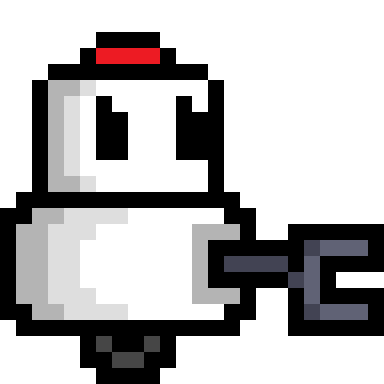
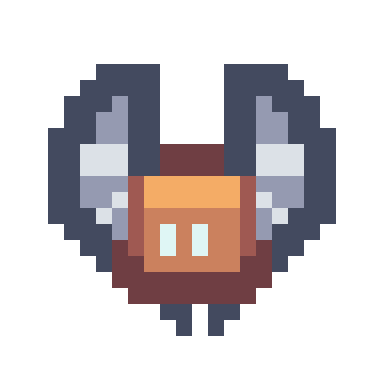

>*Logo del Tecnológico de Monterrey*

# **Overclocked** :robot:

## _Game Design Document_

>*Logo de Overclocked*

---

##### **Copyright notice / author information / boring legal stuff nobody likes**

Este videojuego ha sido desarrollado  a lo largo del semestre febrero-junio de 2025 como parte de la materia TC2005B: Construcción de software y toma de decisiones en el Tecnológico de Monterrey, Campus Santa Fe.

**Profesores:**
- **Desarrollo de videojuegos:** Gilberto Echeverría Furió
- **Desarrollo Web:** Octavio Navarro Hinojosa
- **Base de datos, Análisis y modelación de sistemas de software:** Esteban Castillo Juarez

**Autores del videojuego - Equipo BotRunners**
- Diego Córdova Rodríguez, A01781166
- Lorena Estefanía Chewtat Torres, A01785378
- Eder Jezrael Cantero Moreno, A01785888

## _Index_

---

1. [Index](#index)
2. [Game Design](#game-design)
    1. [Summary](#summary)
    2. [Gameplay](#gameplay)
    3. [Mindset](#mindset)
3. [Technical](#technical)
    1. [Screens](#screens)
    2. [Controls](#controls)
    3. [Mechanics](#mechanics)
4. [Level Design](#level-design)
    1. [Themes](#themes)
        1. Ambience
        2. Objects
            1. Ambient
            2. Interactive
        3. Challenges
    2. [Game Flow](#game-flow)
5. [Development](#development)
    1. [Abstract Classes](#abstract-classes--components)
    2. [Derived Classes](#derived-classes--component-compositions)
6. [Graphics](#graphics)
    1. [Style Attributes](#style-attributes)
    2. [Graphics Needed](#graphics-needed)
7. [Sounds/Music](#soundsmusic)
    1. [Style Attributes](#style-attributes-1)
    2. [Sounds Needed](#sounds-needed)
    3. [Music Needed](#music-needed)
8. [Illustrations](#illustrations)
    1. [Main Character](#main-character)
    2. [Enemies](#enemies)
    3. [Levels](#levels)
    4. [Items](#items)
    5. [GUI Elements](#gui-elements)
9. [List of Assets](#list-of-assets)
    1. [Graphical](#graphical)
    2. [Audio](#audio)
10. [Schedule](#schedule)

## _Game Design_

---

### **Summary**

[Sum up your game idea in 2 sentences. A kind of elevator pitch. Keep it simple!]: #

Overclocked es roguelite de acción en 2D donde encarnas un robot en una competencia de robótica. Explora mapas generados aleatoriamente, derrota rivales mecánicos en combate cuerpo a cuerpo o a distancia y encuentra el botón que activa la sala del jefe final.

Cada victoria te otorga puntos de experiencia para subir de nivel y desbloquear mejoras aleatorias para potenciar tus estadísticas de fuerza, resistencia, velocidad o habilidades de movimiento. Tras completar cada uno de los 3 niveles, desbloqueas armas permanentes que te permitirán reducir el tiempo en el que terminas el juego, ¿Tienes la habilidad para convertirte en el robot definitivo?

### **Gameplay**

[What should the gameplay be like? What is the goal of the game, and what kind of obstacles are in the way? What tactics should the player use to overcome them?]: #

**Descripción del juego**

Overclocked es un juego que incentiva a los jugadores a completar el juego en el menor tiempo posible. El jugador encarna un pequeño robot llamado “Skippy”, quien cuenta con un brazo robótico como arma inicial para enfrentarse a los demás robots de la competencia.

El jugador inicia el videojuego en una sala rectangular de fondo blanco, con un letrero en la pared que indica los controles de movimiento con las teclas “W,A,S,D”. De igual forma, hay un letrero con una flecha hacia la izquierda, guiando al jugador a avanzar en esa dirección.

Al avanzar, el jugador se encuentra con un robot enemigo de categoría Normal (salud y daño equilibrado). En la pared de esta sala, se encuentra un letrero que indica los controles de ataque cuerpo a cuerpo con la tecla “1” y “click derecho” para atacar.

De esta forma, el jugador continúa avanzando por las salas con obstáculos y enemigos generados de forma aleatoria. El jugador puede encontrarse con enemigos de categoría Normal (salud y daño equilibrado), Pesado (salud y daño elevado) y Aéreo (salud y daño bajo).

El jugador debe explorar las salas del nivel hasta encontrar una que contenga un botón azul. Al acercarse, el botón se activa automáticamente, desbloqueando la sala final del nivel, en donde el jugador deberá enfrentarse a un jefe final.

Cada vez que el jugador derrota enemigos, obtiene una bonificación de experiencia, haciendo que cada vez que suba de nivel pueda seleccionar una mejora de estadísticas (salud, daño, protección) o movilidad (doble salto, esquivar (dash)). Al derrotar al jefe final de los niveles, el jugador obtiene un arma permanente que modifica su estadística base de daño.

**Objetivo del juego**

El objetivo principal del juego es que el jugador complete cada uno de los 3 niveles en el menor tiempo posible, lo que implica dominar las mecánicas del juego y obtener cada una de las armas permanentes posibles tras derrotar a cada jefe de los niveles. De esta forma, el juego invita a que los jugadores optimicen su forma de juego para ser más veloces en cada intento, así como los invita a utilizar diferentes estrategias para completar el juego.

**Obstáculos y Retos**

Cada nivel cuenta con tres variaciones de enemigos, mismos que cuentan con distintas estadísticas de salud y daño:
- Robot Normal: Salud - 50 puntos, Daño - 20%
- Robot Pesado: Salud - 75 puntos, Daño - 40%
- Robot Aéreo: Salud - 25 puntos, Daño - 10%

Adicionalmente, el juego cuenta con 3 tipos de obstáculos:
- Cajas de mader/metal (bloquean el paso del jugador/enemigos)
- Picos de metal (dañan al jugador si este se acerca)
- Tuberías de metal (bloquean el paso del jugador/enemigos)

Además, el juego fomenta ser completado en el menor tiempo posible, por lo que el contador de tiempo representa un reto al cual ser vencido. La generación aleatoria de mapas y opciones de habilidades temporales (escogiendo una habilidad de tres después de subir de nivel) fomenta la estrategia y planeación de parte del jugador.

**Tácticas para completar el juego**

- **Dominar las mecánicas del juego:** Los jugadores deben aprender a utilizar el movimiento del personaje a su favor, aprovechando habilidades como el doble salto y esquivar (dash).
- **Aprender patrones de los niveles:** Tras un par de intentos, los jugadores pueden empezar a detectar patrones en la generación de niveles, lo que los puede llevar a optimizar sus rutas o estrategias para derrotar a los enemigos de forma eficaz.
- **Combate agresivo:** Si los jugadores logran adoptar una forma de combate agresiva, pueden lograr un menor tiempo para completar el juego a la vez que suben más niveles y desbloquean mejores habilidades.
- **Decisiones estratégicas:** Probar diferentes combinaciones de habilidades al momento de subir niveles. Esto permite que cada jugador tenga una experiencia diferente de juego y optimicen su forma ideal de jugar.

### **Mindset**

[What kind of mindset do you want to provoke in the player? Do you want them to feel powerful, or weak? Adventurous, or nervous? Hurried, or calm? How do you intend to provoke those emotions?]: #

Overclocked -al igual que una competencia de robótica- fomenta la competitividad, donde solo los mejores son reconocidos por su esfuerzo. De esta forma, el juego busca que los jugadores tengan un deseo por explorar y navegar rápidamente los niveles, en un tiempo no mayor a 5 minutos por cada uno. El juego busca provocar un ambiente apresurado y enérgico en todo momento.

Para provocar estas emociones de rapidez y exploración, el juego muestra en todo momento el mejor tiempo para completar cada nivel, así como el tiempo actual del jugador. De igual forma, la música es enérgica y rápida, lo que permite que los jugadores sientan que deben avanzar en todo momento.

Se busca que el videojuego provoque un deseo por explorar, combatir y completar el juego en el menor tiempo posible, de forma apresurada.

## _Technical_

---

### **Screens**

1. Pantalla principal
    1. Opciones
    2. Estadísticas
    3. Puntuación
    4. Acceder (Iniciar sesión/Registrarse)
2. Historia del juego (imagen)
3. Juego - Nivel 1
4. Juego - Nivel 2
7. Juego - Nivel 3
8. Pantalla de puntuación
9. Fin del juego
10. (Regresa a la pantalla principal)

### **Controls**

[How will the player interact with the game? Will they be able to choose the controls? What kind of in-game events are they going to be able to trigger, and how? (e.g. pressing buttons, opening doors, etc.)]:#

**Movimiento básico**

Los jugadores son capaces de moverse de izquierda, derecha, arriba (saltar) y agacharse. Para esto, se utilizan las teclas W, A, S, D del teclado. Asimismo, conforme el jugador va avanzando de nivel, va desbloqueando algunas habilidades específicas como el doble salto, que se activará presionando dos veces “W”, y el dash, que se activará presionando la tecla “shift”, provocando que el jugador avance rápidamente en la dirección actual en el eje “x” (izquierda o derecha). Debido al tiempo limitado de desarrollo, no se espera que los jugadores sean capaces de modificar ninguna de las teclas definidas para los controles del videojuego. 

**Ataques y curación**

Los jugadores serán capaces de elegir entre dos armas principales: Cuerpo a cuerpo y a distancia. Adicionalmente, el jugador puede seleccionar una poción de curación que solo puede ser utilizada una única vez por nivel y que se regenera al completarlo. Para cambiar de armas/curación, se utilizan los siguientes números del teclado:
- Número 1: Seleccionar arma cuerpo a cuerpo
- Número 2: Seleccionar arma a distancia
- Número 3: Seleccionar poción de curación

**Eventos dentro del juego**

Los botones que deberán ser presionados para abrir la sala del jefe de cada piso se activarán si el jugador se acerca lo suficiente a estos, por lo que no tienen una tecla asignada de activación.

### **Mechanics**

[Are there any interesting mechanics? If so, how are you going to accomplish them? Physics, algorithms, etc.]:#

**Colisiones con objetos sólidos:**

Para las físicas de movimiento, deberemos establecer diferentes atributos para nuestros elementos. Los obstáculos (cajas y tuberías), paredes, techo y suelo de los niveles deben contener una cierta etiqueta que nos permitan identificarlos como objetos sólidos. De esta forma, cuando un personaje, sea el jugador o un enemigo, colisione con un objeto sólido, este no podrá atravesarlo, sino que se detendrá al tocarlo, y tendrá que decidir como esquivar el objeto, ya sea saltando o agachandose.

**Colisiones con enemigos:**

Los jugadores y enemigos deben tener un contenedor definido para delimitar hasta donde llegan. Así, el jugador debe tener un atributo para saber si tiene un arma equipada y está atacando (presionando el “click izquierdo” del ratón). Si esto es así y su contenedor coincide con el de los enemigos, se restará la salud de los enemigos y la cantidad de daño del jugador. De la misma forma, si un jugador no está atacando y su contenedor coincide con el de los enemigos, se restará su salud y la cantidad de daño de los enemigos. Esto mismo aplica para el arma a distancia; cuando un jugador dispare, se creará un rectángulo que si impacta con los enemigos se resta su salud.

**Mecánica de tiempo:**

Esta mecánica consiste en un contador de tiempo que incrementa con el tiempo de juego en cada partida de los jugadores. Para implementar esta mecánica y hacer nuestro juego más interesante, pondremos un cronómetro en la esquina superior izquierda de la pantalla. Al hacer esto, crearemos una atmósfera de presión, lo cual hará que el jugador busque siempre terminar el juego en un menor tiempo posible y romper su récord actual.

**Subir/bajar escaleras:**

Para pasar a algunas salas, el jugador necesitará subir o bajar una escalera. Cada escalera contendrá un atributo que define si se puede subir, bajar o ambos. Las diferentes escaleras tendrán indicadores que le hagan saber al jugador hacia qué dirección puede trasladarse. Cuando el contenedor de un jugador colisione con el de una escalera, éste podrá desplazarse sin gravedad de acuerdo a los atributos de la escalera.

**Mecánica de armas a cuerpo y a distancia**

Con el fin de crear un videojuego con mecánicas de combate diversas, se decidió implementar dos distintas armas desbloqueables en el juego.

En un inicio, el jugador solo posee el brazo de su robot como arma cuerpo a cuerpo para hacer daño a los enemigos. Tras completar cada uno de los 3 niveles, desbloquea un arma particular. A continuación se especifica cada una de ellas:

- Si el jugador no ha completado ningún nivel: Su arma principal es su brazo robótico. Este aumenta el daño del jugador en un 0% cuando la utiliza y se puede usar cada 0.5 segundos.

- Si el jugador completó el primer nivel: Su arma principal es la llave de acero. Esta aumenta el daño del jugador en un 20% cuando la utiliza y se puede usar cada 0.5 segundos.

- Si el jugador completó el segundo nivel: Su arma secundaria es la pistola láser lenta. Esta aumenta el daño del jugador en un 30% cuando la utiliza y se puede usar cada 2 segundos.

- Si el jugador completó el tercer nivel: Su arma secundaria es la pistola láser rápida. Esta aumenta el daño del jugador en un 40% cuando la utiliza y se puede usar cada 1 segundo.

Para lograr agregar cada una de estas armas al juego, consideramos los siguientes aspectos:
- Para el arma inicial (brazo del robot), el robot tiene animaciones básicas (moverse, saltar, agacharse, atacar).
- Para la llave de acero, el robot cuenta con animaciones adicionales para mostrar el arma (moverse, saltar, agacharse, atacar).
- Para la pistola láser lenta y rápida, las animaciones del arma principal (llave de acero) se mantienen, lanzando proyectiles (rectángulos pequeños de color rojo) al atacar con la pistola láser.

Cada una de estas armas se desbloquea de forma permanente para todas las partidas del jugador.

**Mecánica de experiencia**

Con el fin de crear una mecánica de juego que fomenta las recompensas aleatorias conforme al avance del jugador, este tendrá un nivel de experiencia que irá aumentando desde el nivel 0 hasta el 10. Para incrementar el nivel de experiencia del jugador, este deberá derrotar enemigos, lo que le otorgará una pequeña fracción de la experiencia total a conseguir para subir de nivel, dependiendo de la categoría de enemigos.

En el nivel de experiencia 0, el jugador debe conseguir 100 puntos de experiencia. Cada vez que el jugador aumenta de nivel de experiencia, los puntos requeridos para seguir avanzando aumentan en 15. Ejemplo:
- Nivel 0: El jugador necesita 100 puntos para subir de nivel.
- Nivel 1: El jugador necesita 115 puntos para subir de nivel.
- Nivel 2: El jugador necesita 130 puntos para subir de nivel.
- Así sucesivamente hasta llegar al nivel 10, el cual necesitará 245 puntos.

Cada enemigo otorga un porcentaje diferente de experiencia al jugador:
- Robot Normal: +10% de experiencia
- Robot Pesado: + 20% de experiencia
- Robot Aéreo: +15% de experiencia
- Jefe Final: +100% de experiencia (1 nivel completo)

Al subir de nivel, el jugador podrá elegir una de tres opciones aleatorias para mejorar su personaje. La lista completa de habilidades a desbloquear por el jugador es la siguiente:
- +10% de ataque
- +10% de salud
- +10% de defensa
- Doble salto (Solo se puede desbloquear una vez)
- Esquivar (dash) (Solo se puede desbloquear una vez)

Para otorgar estas habilidades al jugador, se deberá contar con una lista que se actualizará conforme el jugador suba de nivel, eliminando aquellas habilidades que el jugador haya obtenido y solo se puedan adquirir una vez por partida, como el doble salto o la habilidad de esquivar.

Por otro lado, las habilidades desbloqueables que mejoran las estadísticas base del jugador (ataque, salud, defensa) podrán ser obtenidas de forma acumulativa, siempre y cuando el jugador siga subiendo de nivel. Estas estadísticas se reiniciarán cuando el jugador pierda/gane el juego.

**Mecánica de movimiento**

El jugador es capaz de moverse en cuatro direcciones: arriba (saltar), moverse a la derecha, a la izquierda y agacharse. A continuación se especifican las características de cada movimiento:
- Saltar: El jugador es capaz de moverse hacia arriba al presionar la tecla “w”, ejecutando una animación de salto.
- Moverse a la derecha o izquierda: El jugador puede moverse en ambas direcciones de los niveles al presionar la tecla “a” (izquierda) o “d” (derecha), ejecutando una misma animación en dirección en la que se mueve.
- Agacharse: El jugador es capaz de agacharse al presionar la tecla “s”, reduciendo su área para lograr atravesar obstáculos o situaciones en donde se tiene menos espacio. Existe una animación que es ejecutada al momento en el que el jugador se agacha.

**Habilidades de movimiento desbloqueables:**

- Doble salto: El jugador es capaz de utilizar la habilidad de doble salto una vez la desbloquee al presionar la tecla “w” dos veces, lo cual le permitirá saltar el doble de distancia, ejecutando de nuevo la misma animación del salto normal.
- Esquivar: El jugador es capaz de desplazarse rápidamente en muy poco tiempo al presionar la tecla shift, lo cual puede usar para esquivar ataques de enemigos o acortar su tiempo de la partida.

## _Level Design_

---

### **Themes**

1. Escuela
    1. Ambiente
        1. Competencia, tenso, activo
    2. Objetos
        1. _Ambiente_
            1. Letreros para guiar al jugador
            2. Pizarras
            3. Cajas de madera
        2. _Interactivos_
            1. Botón azúl
            2. Puertas
            3. Escaleras
            4. Robot Normal (enemigo)
            5. Robot Pesado (enemigo)
            6. Robot Aéreo (enemigo)
            7. Jefe Final (enemigo)
2. Laboratorio
    1. Ambiente
        1. Competencia, tenso, activo
    2. Objetos
        1. _Ambiente_
            1. Letreros para guiar al jugador
            2. Pantallas de computadora
            3. Tuberías
            4. Cajas de metal
        2. _Interactivos_
            1. Botón azúl
            2. Puertas
            3. Escaleras
            4. Robot Normal (enemigo)
            5. Robot Pesado (enemigo)
            6. Robot Aéreo (enemigo)
            7. Jefe Final (enemigo)
3. Fábrica
    1. Ambiente
        1. Competencia, tenso, activo
    2. Objetos
        1. _Ambiente_
            1. Letreros para guiar al jugador
            2. Cajas de metal
            3. Tuberías
            4. Tubos de ensayo
        2. _Interactivos_
            1. Botón azúl
            2. Puertas
            3. Escaleras
            4. Robot Normal (enemigo)
            5. Robot Pesado (enemigo)
            6. Robot Aéreo (enemigo)
            7. Jefe Final (enemigo)

### **Game Flow**

1. El jugador inicia en una sala vacía de laboratorio.
2. Pared a la izquierda, el jugador debe avanzar a la derecha y saltar una caja.
3. La pared muestra un letrero que muestra las direcciones en las que puede avanzar el jugador.
4. El jugador avanza a la derecha y salta la caja de madera/metal en el suelo.
5. El jugador entra en la segunda sala por el extremo izquierdo.
6. El jugador encuentra un enemigo estático en el extremo derecho.
7. El jugador observa en la pared un letrero que le indica cómo seleccionar su arma cuerpo a cuerpo y cómo utilizarla.
8. El jugador derrota al enemigo y avanza a la siguiente sala.
9. El jugador continúa avanzando por salas a la vez que derrota enemigos.
10. El jugador sube un nivel de experiencia. Se le presenta una pantalla con 3 distintas opciones de estadísticas/habilidades a desbloquear. El jugador selecciona una.
11. El jugador continúa su camino y encuentra unas escaleras en el centro de una sala. Puede seguir adelante o acercarse a las escaleras.
12. Las escaleras tienen un letrero para subir/bajar o ambos.
13. El jugador puede subir/bajar o ambos por las escaleras.
14. El jugador encuentra una sala con un botón azul.
15. El jugador se acerca al botón azul y este se activa automáticamente, mostrando un letrero que dice que la sala del jefe se ha activado.
16. El jugador busca la sala del jefe final del nivel (si no la ha encontrado), entra y lo derrota.
17. Tras derrotar al jefe, el jugador sube de nivel de experiencia automáticamente y el jugador es capaz de desbloquear una nueva habilidad aleatoria.
18. Tras derrotar a cada jefe de cada uno de los 3 niveles, el jugador obtiene un arma permanente.
    1. Espada.
    2. Pistola láser que dispara lento.
    3. Pistola láser que dispara rápido.
19. El jugador obtiene una poción de curación de un solo uso para el siguiente nivel.
20. El jugador avanza al siguiente nivel y repite el proceso.
21. Si el jugador termina el juego, se muestran las estadísticas del jugador:
    - Tiempo de partida
    - Número de muertes
    - Enemigos derrotados
    - Número total de daño infligido y recibido
    - Número de partidas completadas.
22. Se muestra la tabla de las mejores 5 puntuaciones de tiempo.
22. El jugador es devuelto al menú principal.

## _Development_

---

### **Abstract Classes / Components**

1. BasePhysics: Física del juego, colisiones, movimiento, gravedad.
    1. BasePlayer: Control de jugador, experiencia, armas, habilidades.
    2. BaseEnemy: Define enemigos, movimiento.
  3. BaseObject: Define elementos que interactúan de alguna forma con el jugador, como orbes de experiencia tras derrotar a los enemigos.
2. BaseObstacle: Define elementos que pueden bloquear/dañar al jugador, como cajas, tuberías y picos en las salas de los niveles.
3. BaseInteractable: Objetos con los que el jugador puede interactuar, como el botón que desbloquea la sala del jefe y las escaleras para subir/bajar/ambos.
4. BaseSound: Control de los sonidos/música del juego.
5. BaseGameState: Control de los estados del juego, como menú principal y pausa.
6. BaseLevel: Control de los niveles, generación de mapas aleatorios, ubicación de enemigos y objetos.
7. BaseUI: Control de la interfaz de usuario, como el cronómetro, barra de salud, barra de experiencia, habilidades desbloqueables, etc.
8. BaseGame: Control principal del juego, carga de niveles, control de la música, sonidos, etc.

### **Derived Classes / Component Compositions**

1. BasePlayer
    1. PlayerMain
    2. PlayerUnlockable
2. BaseEnemy
    1. EnemyWolf
    2. EnemyGoblin
    3. EnemyGuard (may drop key)
    4. EnemyGiantRat
    5. EnemyPrisoner
3. BaseObject
    1. ObjectRock (pick-up-able, throwable)
    2. ObjectChest (pick-up-able, throwable, spits gold coins with key)
    3. ObjectGoldCoin (cha-ching!)
    4. ObjectKey (pick-up-able, throwable)
4. BaseObstacle
    1. ObstacleWindow (destroyed with rock)
    2. ObstacleWall
    3. ObstacleGate (watches to see if certain buttons are pressed)
5. BaseInteractable
    1. InteractableButton

_(example)_

## _Graphics_

---

### **Style Attributes**

**Paleta de colores:**

Para el videojuego Overclocked, se utiliza la siguiente paleta de colores base:
- Rojo: #FF1053
- Morado: #6C6EA0
- Azul claro: #66C7F4
- Gris: #C1CAD6
- Blanco: #FFFFFF
Adicionalmente, los enemigos cuentan con los siguientes colores:
- Robot Normal:
    - Naranja claro: FC683B
    - Naranja medio: #DD442C
    - Naranja oscuro: #7E3125
    - Gris claro: #DCELE7
    - Gris medio: #959AB1
- Robot Pesado:
    - Azul claro: #2CC5F6
    - Azul oscuro: #1490C3
    - Naranja oscuro: #7E3125
    - Gris claro: #DCELE7
    - Gris medio: #959AB1
- Robot Aéreo:
    - Café claro: #F4AC66
    - Café medio: #CB815E
    - Café oscuro: #6F3E43
    - Gris claro: #DCELE7
    - Gris medio: #959AB1
- Contorno de los enemigos
- Gris oscuro: #434A5F

De esta forma, Overclocked utiliza tonos claros entre blanco, gris, azul, rojo, naranja y café. Se busca que estos tonos creen una atmósfera minimalista, buscando utilizar tan solo 3 tonos entre colores. Ejemplo de esto es el gris, que solo tiene una variante clara, media y oscura.

El estilo gráfico del juego es de 32 bits, por lo que se busca que el diseño de los personajes sea minimalista tipo retro. Para esto, los personajes deben contar con bordes negros/gris oscuro que resalten su silueta del ambiente resto de elementos en la pantalla.

**Reglas de diseño de Overclocked:**

Para establecer un estilo determinado y homogéneo a lo largo del videojuego, establecieron las siguientes reglas de diseño:

1. Personajes y assets de 32 bits.
2. Paleta de colores pastel: blanco, gris, azul, rojo, naranja y café.
3. Personajes llamativos y animados: Cada personaje debe tener una animación atractiva de al menos 3 fotogramas al moverse e interactuar con el jugador.
4. Silueta oscura: Tanto los personajes como los recursos (assets) del videojuego deben contar con una silueta oscura, separándolos del fondo, escenarios y demás  elementos del videojuego.
5. El diseño de los personajes debe ser minimalista estilo retro: Para lograr esto, los personajes deben contar con ojos grandes y no más de 7 tonalidades de la paleta de color.
6. Al tener en cuenta que los robots son la temática del juego, estos deben tener características que enfaticen su función. Ejemplo: El robot del jugador puede moverse y atacar en todas direcciones, por lo que su diseño cuenta con un brazo expandible y una rueda que lo ayuda a trasladarse por los escenarios.
7. Los personajes pueden tener bordes afilados que resalten su silueta, así como otros que sean curvados.

**Retroalimentación:**

El jugador puede recibir retroalimentación de qué realizar en diferentes situaciones del videojuego:
- Activar botones: Los botones cuentan con una silueta luminosa que hace que destaquen del resto de elementos en la sala.
- Mini-mapa: El jugador cuenta con un mini-mapa disponible en la esquina superior derecha en todo momento para conocer su ubicación en el nivel.
- Cronómetro: El jugador cuenta con un cronómetro disponible en la esquina superior izquierda en todo momento. Con este elemento, el jugador podrá conocer el tiempo que ha invertido en todo momento en el videojuego.
- Letreros: En las primeras 2 salas de juego del primer nivel, el jugador puede consultar letreros ubicados en el fondo de la sala con la siguiente información:
- Nivel 1: Letrero que indica al jugador las teclas para moverse (W,A,S,D).
- Nivel 2: Letrero que indica al jugador las teclas para atacar (Click derecho del ratón).
- Indicadores: Cuando un jugador se encuentra frente a una escalera, esta cuenta con un letrero que indica una flecha en la dirección en la que el jugador puede subir/bajar/ambos.

### **Graphics Needed**

1. Personajes
    1. Robots
        1. Principal (Skippy) (idle, caminar, saltar, agacharse, atacar, recibir daño)
        2. Robot Normal (idle, caminar, atacar, recibir daño)
        3. Robot Pesado (idle, caminar, atacar, recibir daño)
        4. Robot Volador (idle, volar, atacar, recibir daño)
        5. Jefe (idle, caminar, atacar, recibir daño)
2. Bloques
    1. Contenedor (caja de madera, obstáculo)
    2. Contenedor (caja de metal, obstáculo)
    3. Suelo de baldosas
    4. Muro de laboratorio
    5. Muro de escuela
    6. Muro de fábrica abandonada
    7. Tubería de metal (obstáculo)
    8. Picos puntiagudos (obstáculo)
3. Ambiente
    3. Letreros
4. Otros
    1. Botón azul (desbloquea la sala del jefe final de cada nivel)
    2. Puerta de laboratorio (se abre al presionar el botón azul)

## _Sounds/Music_

---

### **Style Attributes**

Again, consistency is key. Define that consistency here. What kind of instruments do you want to use in your music? Any particular tempo, key? Influences, genre? Mood?

Stylistically, what kind of sound effects are you looking for? Do you want to exaggerate actions with lengthy, cartoony sounds (e.g. mario&#39;s jump), or use just enough to let the player know something happened (e.g. mega man&#39;s landing)? Going for realism? You can use the music style as a bit of a reference too.

Remember, auditory feedback should stand out from the music and other sound effects so the player hears it well. Volume, panning, and frequency/pitch are all important aspects to consider in both music _and_ sounds - so plan accordingly!

### **Sounds Needed**

1. Effectos
    1. Giro de rueda (movimiento del jugador, igual para todo tipo de suelos)
    2. Salto del jugador
    3. Agacharse
    4. Aterrizaje del jugador (al caer verticalmente)
    5. Ataque cuerpo a cuerpo (al atacar enemigos u objetos)
    6. Ataque a distancia (pistola láser)
    7. Abrir puerta
2. Retroalimentación (Feedback)
    1. Abrir botella (recuperar salud)
    2. Golpe (daño hacia el jugador)
    3. Presionar botón
    4. Golpe exagerado (enemigo derrotado)
    5. Explosión pequeña (jugador derrotado)

### **Music Needed**

1. Música lenta-melódica para el menú principal.
2. Música tenue-lenta para menú de settings(Aplicable a todas las páginas de settings independientemente del nivel) 
3. Música rápida-enérgica con efectos de sonido que evoquen a escritura o a un salón de clases(nivel 1).
4. Música rápida-enérgica, con efectos de sonido de química, sonidos genéricos de ciencia (nivel dos).
5. Música lúgubre, efectos de sonido mecánicos, eco, alta reverberación (nivel 3).
6.Música épica, con sonidos cyberpunk-mecánicos (Final boss).
7. Música feliz-nostálgica(créditos finales).
*Las canciones del nivel 1 y 2, al llegar al boss del nivel acelerarán su velocidad.

## _Illustrations_

---

### **Main Character**

>Primeros bocetos de Skippy

>Idle

>Caminar

>Saltar

>Agacharse

>Ataque cuerpo a cuerpo

>Ataque a distancia

### **Enemies**

>Robot Normal

>Robot Pesado

>Robot Aéreo

### **Levels**

>Introducción del juego

Skippy es un robot dieseñado para combatir en una competencia de robótica. Después de ser activado, descubre que debe completar una serie de niveles en el menor tiempo posible para ser reconocido como ganador de la competencia. Sin tiempo que perder, Skippy se adentra en el primer nivel de la competencia.

**Estructura de niveles:**

>Los niveles cuentan con una estructura lineal con 1 o 2 bifurcaciones en salas intermedias. Cada sala contiene enemigos y obstáculos aleatorios, así como un botón para abrir la sala del jefe final.

### **Items**

### **GUI Elements**

**Recorrido del jugador:**

>El juego muestra los principales controles de movimiento del jugador, así como un mini-mapa para guiarlo y un cronómetro para medir su tiempo de partida.

>El jugador debe enfrentarse al primer enemigo, seleccionando su arma cuerpo a cuerpo y aprendiendo a atacar.
El jugador puede ver su barra de salud, barra de experiencia y objeto de curación en todo momento.

>El jugador puede subir de nivel de experiencia tras derrotar cada enemigo.

>El jugador puede seleccionar una habilidad aleatoria tras subir de nivel.

## _List of Assets_

---

### **Graphical**

### **Audio**

## _Schedule_

Sprint 1:

1. Desarrollar clases base
    1. Entidades base
        1. Jugador base
        2. Enemigo base (uso de polimorfismo para los diferentes métodos de ataque)
        3. Bloque base
  2. Estado base de app
        1. Mundo del juego
        2. Mundo del menú

Sprint 2:

3. Desarrollar las clases de jugador y bloques
    1. Físicas/Colisiones (hitbox genérico para todos los bloques)
3.1. Encontrar físicas de controles agradables
4. Desarrollar clases derivadas
    1. Bloques
        1. Estáticos
        2. Abrir (método de clase puerta  dependiente de “botón”)
        3. Botón
    2. Enemigos
        1. Robot Normal
        2. Robot Pesado
        3. Robot Aéreo
        4. Jefe Final

Sprint 3 y 4:

5. Diseño de niveles
    1. Introducir movimiento/salto
    2. Introducir ataque
    3. Tener en cuenta el paso del jugador, para que pueda practicar entre lecciones.

Sprint 5:

6. Diseño de sonidos
7. Diseño de música
