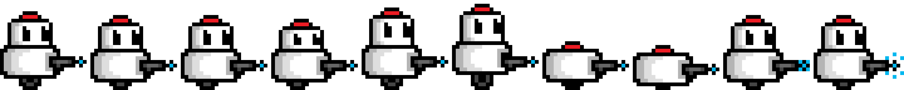

# **Overclocked** :robot::wrench::zap:

## _Documento de Diseño de Videojuego_ :video_game:
### _Game Design Document_

>*Logo del Tecnológico de Monterrey*

>*Logo de Overclocked*

---

##### **Aviso de derechos de autor / información del autor** :warning:

Este videojuego ha sido desarrollado a lo largo del semestre febrero-junio de 2025 como parte de la materia TC2005B: Construcción de software y toma de decisiones en el Tecnológico de Monterrey, Campus Santa Fe.

**Profesores:** :mortar_board:
- **Desarrollo de videojuegos:** Gilberto Echeverría Furió
- **Desarrollo Web:** Octavio Navarro Hinojosa
- **Base de datos, análisis y modelación de sistemas de software:** Esteban Castillo Juarez

**Autores del videojuego - Equipo BotRunners** :robot:
- Diego Córdova Rodríguez, A01781166
- Lorena Estefanía Chewtat Torres, A01785378
- Eder Jezrael Cantero Moreno, A01785888

## :bookmark_tabs: _Índice_

---

1. [Índice](#índice)
2. [Diseño del juego](#diseño-del-juego)
    1. [Resumen](#Resumen)
    2. [Jugabilidad](#jugabilidad)
    3. [Mentalidad](#mentalidad)
    4. [Historia](#historia)
3. [Técnico](#técnico)
    1. [Pantallas](#pantallas)
    2. [Controles](#controles)
    3. [Mecánicas](#mecánicas)
4. [Diseño de niveles](#diseño-de-niveles)
    1. [Temas](#temas)
    2. [Estructura de niveles](#estructura-de-niveles)
    2. [Retos](#retos)
    2. [Game Flow](#game-flow)
5. [Desarrollo](#desarrollo)
    1. [Clases abstractas](#clases-abstractas--componentes)
    2. [Clases derivadas](#clases-derivadas--composiciones-de-componentes)
6. [Gráficos](#gráficos)
    1. [Atributos de estilo](#atributos-de-estilo)
    2. [Gráficos necesarios](#gráficos-necesarios)
7. [Sonido/Música](#sonidomúsica)
    1. [Atributos de estilo](#atributos-de-estilo-1)
    2. [Sonidos necesarios](#sonidos-necesarios)
    3. [Música necesaria](#música-necesaria)
8. [Ilustraciones](#ilustraciones)
    1. [Personaje principal](#personaje-principal)
    2. [Enemigos](#enemigos)
    3. [Niveles](#niveles)
    4. [Items](#items)
    5. [Elementos GUI](#elementos-gui)
    5. [Pantallas](#pantallas-1)
9. [Lista de assets](#lista-de-assets)
    1. [Gráficos](#gráficos-1)
    2. [Audio](#audio)
10. [Cronograma](#cronograma)
11. [Conclusiones](#conclusiones)

## _Diseño del juego_

---

### **Resumen**

Overclocked es un videojuego roguelite de acción en 2D donde encarnas un robot en una competencia de robótica. Explora mapas generados aleatoriamente, derrota rivales mecánicos en combate cuerpo a cuerpo o a distancia y encuentra el botón que activa la sala del jefe final.

Cada victoria te otorga puntos de experiencia para subir de nivel y desbloquear mejoras aleatorias para potenciar tus estadísticas de fuerza, resistencia, velocidad o habilidades de movimiento. Tras completar cada uno de los 3 niveles, desbloqueas armas permanentes que te permitirán reducir el tiempo en el que terminas el juego, ¿Tienes la habilidad para ser el mejor en la competencia de robots?

### **Jugabilidad**

[What should the gameplay be like? What is the goal of the game, and what kind of obstacles are in the way? What tactics should the player use to overcome them?]: #

**Descripción del juego**

Overclocked es un juego que incentiva a los jugadores a completar el juego en el menor tiempo posible. El jugador encarna un pequeño robot llamado “Skippy”, quien cuenta con un brazo robótico como arma inicial para enfrentarse a los demás robots de la competencia.

El jugador inicia el videojuego en una sala rectangular de fondo blanco, con un letrero en la pared que indica los controles de movimiento con las teclas “W,A,S,D”. De igual forma, hay un letrero con una flecha hacia la derecha, guiando al jugador a avanzar en esa dirección.

Al avanzar, el jugador se encuentra con un robot enemigo de categoría Normal (salud y daño equilibrado). En la pared de esta sala, se encuentra un letrero que indica los controles de ataque cuerpo a cuerpo con la tecla “1” y “flecha derecha/izquierda” para atacar.

De esta forma, el jugador continúa avanzando por las salas con obstáculos y enemigos generados de forma aleatoria. El jugador puede encontrarse con enemigos de categoría Normal (salud y daño equilibrado), Pesado (salud y daño elevado) y Aéreo (salud y daño bajo).

El jugador debe explorar las salas del nivel hasta encontrar una que contenga un botón azul. Al acercarse, el botón se activa automáticamente, desbloqueando la sala final del nivel, en donde el jugador deberá enfrentarse a un jefe final.

Cada vez que el jugador derrota enemigos, obtiene una bonificación de experiencia, haciendo que cada vez que suba de nivel pueda seleccionar una mejora de estadísticas (salud, daño, protección) o movilidad (doble salto, esquivar (dash)). Al derrotar al jefe final de los niveles, el jugador obtiene un arma permanente que modifica su estadística base de daño.

**Objetivo del juego**

El objetivo principal del juego es que el jugador complete cada uno de los 3 niveles en el menor tiempo posible, lo que implica dominar las mecánicas del juego y obtener cada una de las armas permanentes posibles tras derrotar a cada jefe de los niveles. De esta forma, el juego invita a que los jugadores optimicen su forma de juego para ser más veloces en cada intento, así como los invita a utilizar diferentes estrategias para completar el juego.

**Obstáculos y Retos**

Cada nivel cuenta con tres variaciones de enemigos, los cuales tienen distintas estadísticas de salud y daño:
- Robot Normal: Salud - 50 puntos, Daño - 20 puntos
- Robot Pesado: Salud - 75 puntos, Daño - 40 puntos
- Robot Aéreo: Salud - 25 puntos, Daño - 10 puntos
- Jefe Final: Salud - 100 puntos, Daño - 50 puntos

Cada enemigo reacciona de forma diferente al jugador:
- Robot Normal: Se mueve rápidamente hacia el jugador y ataca cuerpo a cuerpo.
- Robot Pesado: Se mueve lentamente hacia el jugador y ataca cuerpo a cuerpo.
- Robot Aéreo: Se mantiene en el aire, desplazándose de forma horizontal. Ataca al jugador cuando este se encuentra en su misma altura.
- Jefe Final: Combina las habilidades de los enemigos anteriores, teniendo 2 fases de combate:
    - Fase 1 (estado normal): Se activa cuando la salud del jefe es mayor a 20%. Avanza hacia el jugador lentamente y ataca cuerpo a cuerpo.
    - Fase 2 (estado furioso): Se activa cuando la salud del jefe es menor a 20%. Se desplaza rápidamente hacia el jugador, saltando desde su última posición hasta la del jugador. Ataca cuerpo a cuerpo.

Adicionalmente, el juego cuenta con 3 tipos de obstáculos:
- Cajas de madera/metal (bloquean el paso del jugador/enemigos)
- Picos de metal (dañan al jugador si este se acerca)
- Tuberías de metal (bloquean el paso del jugador/enemigos)

Además, el juego fomenta ser completado en el menor tiempo posible, por lo que el contador de tiempo representa un reto al cual ser vencido. La generación aleatoria de niveles y opciones de habilidades temporales (escogiendo una habilidad de tres después de subir de nivel) fomenta la estrategia y planeación de parte del jugador.

**Tácticas para completar el juego**

- **Dominar las mecánicas del juego:** Los jugadores deben aprender a utilizar el movimiento del personaje a su favor, aprovechando habilidades como el doble salto y esquivar (dash).
- **Aprender patrones de los niveles:** Tras un par de intentos, los jugadores pueden empezar a detectar patrones en la generación de niveles, lo que los puede llevar a optimizar sus rutas o estrategias para derrotar a los enemigos de forma eficaz.
- **Combate agresivo:** Si los jugadores logran adoptar una forma de combate agresiva, pueden lograr un menor tiempo para completar el juego a la vez que suben más niveles y desbloquean mejores habilidades.
- **Decisiones estratégicas:** Probar diferentes combinaciones de habilidades al momento de subir niveles. Esto permite que cada jugador tenga una experiencia diferente de juego y optimicen su forma ideal de jugar.

### **Mentalidad**

Overclocked -al igual que una competencia de robótica- fomenta la competitividad, donde solo los mejores son reconocidos por su esfuerzo. De esta forma, el juego busca que los jugadores tengan un deseo por explorar y navegar rápidamente los niveles, en un tiempo no mayor a 5 minutos por cada uno. El juego busca provocar un ambiente apresurado y enérgico en todo momento.

Para provocar estas emociones de rapidez y exploración, el juego muestra en todo momento el mejor tiempo para completar cada nivel, así como el tiempo actual del jugador. De igual forma, la música es enérgica y rápida, lo que permite que los jugadores sientan que deben avanzar en todo momento.

Se busca que el videojuego provoque un deseo por explorar, combatir y completar el juego en el menor tiempo posible, de forma apresurada.

### **Historia**

La historia de Overclocked es simple y directa: El jugador encarna a un pequeño robot llamado "Skippy" que ha sido creado para competir en una competencia de robótica. En esta competencia, robots como Skippy buscan los botones azules que activan la sala del jefe final de cada nivel.

De esta forma, cada robot que Skippy encuentra es un participante más de la competencia. Para que cualquier robot pueda avanzar a la siguiente etapa, se debe derrotar al jefe final de cada nivel, diseñado por los organizadores de la competencia para poner a prueba las habilidades de los robots.

**El pasado de Skippy**

Skippy no conoce nada de su pasado, ya que fue creado para participar en la competencia de robótica. Sin embargo, ha sido construido con diversos atributos que lo hacen único y especial al resto de robots. Skippy cuenta con un brazo robótico que le permite atacar a sus enemigos, así como con la capacidad moverse rápidamente gracias a su llanta en la parte inferior.

El diseño escalable de Skippy le permite mejorar sus habilidades a lo largo de la competencia, siendo capaz de obtener doble salto, esquivar (dash) y armas a distancia que le permiten ser más eficiente en combate.

El origen de la competencia de robótica, así como sus organizadores y colaboradores es desconocido para Skippy, quien solo busca completar la competencia en el menor tiempo posible y demostrar que es el mejor en esta.

**¿Cómo se cuenta la historia?**

La historia de Overclocked se contará a través de un breve cómic al inicio del juego, donde se muestra la información básica de la competencia y el objetivo de Skippy.

En este cómic, Skippy es activado por primera vez y se le informa que ha sido creado para competir en la competencia de robótica. A partir de este momento, se le informa al jugador que debe avanzar por los diferentes niveles, derrotar a los enemigos y jefes finales, completando los tres niveles en el menor tiempo posible.

De esta forma, el jugador es capaz de entender la historia y el objetivo del juego sin la necesidad de tener una narrativa extensa.

**Elementos clave de la historia**

- **Ambiente:** Los diferentes niveles del juego (escuela, laboratorio, fábrica) no son más que escenarios de la competencia de robótica. Cada nivel representa una etapa diferente de la misma. Para ver más detalles sobre los niveles, revisar la sección [Diseño de niveles](#diseño-de-niveles).
- **Música:** La música del juego es enérgica, lo que permite que los jugadores sientan la necesidad de avanzar rápidamente por los niveles. Para ver más detalles sobre la música, revisar la sección [Sonido/Música](#sonidomúsica).
- **Diseño de niveles:** Los diferentes enemigos y obstáculos que se encuentran en los niveles son parte de la competencia de robótica, diseñados para poner a prueba las habilidades de los robots participantes. Para ver más detalles sobre los enemigos y obstáculos, revisar la sección [Jugabilidad](#jugabilidad).

## _Técnico_

---

### **Pantallas**

1. Pantalla principal: Muestra las opciones que el jugador puede seleccionar al iniciar el juego.
    1. Jugar: Inicia el juego desde el primer nivel.
    2. Opciones: Permite al jugador modificar el volumen de la música y efectos de sonido.
    3. Estadísticas: Muestra las estadísticas del jugador.
        - Tiempo de partida
        - Número de muertes
        - Enemigos derrotados
        - Número total de daño infligido y recibido
        - Número de partidas completadas.
    4. Puntuaciones: Muestra los jugadores con los mejores tiempos en completar el juego.
        - Nombre del jugador
        - Tiempo en completar el juego.
    5. Acceder: Permite al jugador iniciar sesión o registrarse.
2. Historia del juego (imagen): Muestra la historia del juego a través de un cómic.
3. Juego - Nivel 1: Muestra el primer nivel del juego, con el jugador en la primera sala.
4. Juego - Nivel 2: Muestra el segundo nivel del juego, con el jugador en la primera sala.
7. Juego - Nivel 3: Muestra el tercer nivel del juego, con el jugador en la primera sala.
8. Pantalla de puntuación: Muestra el tiempo en el que el jugador completó el juego y si logró superar su mejor tiempo. Se muestran estadísticas del jugador, así como las habilidades desbloqueadas.
9. Pantalla de derrota: Muestra un mensaje de derrota cuando el jugador pierde todos sus puntos de salud. Le permite reiniciar el nivel o regresar a la pantalla principal.
10. Pantalla de victoria: Muestra un mensaje de victoria cuando el jugador completa el juego. Le permite regresar a la pantalla principal.
11. Pausa: Muestra las opciones de pausa. Permite que el jugador continúe, ajuste el volumen o regrese a la pantalla principal.

*Para ver los bocetos de las pantallas, revisar la sección [Elementos GUI](#elementos-gui).*

### **Controles**

**Movimiento básico**

Los jugadores son capaces de moverse de izquierda, derecha, arriba (saltar) y agacharse. Para esto, se utilizan las teclas W, A, S, D del teclado. Asimismo, conforme el jugador va avanzando de nivel, va desbloqueando algunas habilidades específicas como el doble salto, que se activará presionando dos veces “W”, y el dash, que se activará presionando la tecla “shift”, provocando que el jugador avance rápidamente en la dirección actual en el eje “x” (izquierda o derecha). Debido al tiempo limitado de desarrollo, no se espera que los jugadores sean capaces de modificar ninguna de las teclas definidas para los controles del videojuego. 

**Ataques y curación**

Los jugadores serán capaces de elegir entre dos armas principales: cuerpo a cuerpo y a distancia. Para utilizar estas, el jugador necesitará presionar ya sea la flecha derecha o izquierda dependiendo la dirección hacia donde quiera realizar el ataque. Adicionalmente, el jugador puede seleccionar una poción de curación que solo puede ser utilizada una única vez por nivel y que se regenera al completarlo. Para cambiar de armas/curación, se utilizan los siguientes números del teclado:
- Número 1: Seleccionar arma cuerpo a cuerpo
- Número 2: Seleccionar arma a distancia
- Número 3: Usar poción de curación

**Eventos dentro del juego**

Los botones que deberán ser presionados para abrir la sala del jefe de cada piso se activarán si el jugador se acerca lo suficiente a estos, por lo que no tienen una tecla asignada de activación.

Cuando el jugador se encuentra frente a una escalera, el jugador podrá subir o bajar presionando la tecla "W" o "S", respectivamente. Esto desplazará al jugador en la dirección de la escalera, sin necesidad de presionar otra tecla adicional. Estas acciones se realizan de forma automática al momento de colisionar con la escalera.

### **Mecánicas**

**Colisiones con objetos sólidos:**

Para las físicas de movimiento, deberemos establecer diferentes atributos para nuestros elementos. Los obstáculos (cajas, tuberías y picos de metal), paredes, techo y suelo de los niveles deben contener una cierta etiqueta que nos permitan identificarlos como objetos sólidos. De esta forma, cuando un personaje, sea el jugador o un enemigo, colisione con un objeto sólido, este no podrá atravesarlo, sino que se detendrá al tocarlo, y tendrá que decidir como esquivar el objeto, ya sea saltando o agachandose.

**Colisiones con enemigos:**

Los jugadores y enemigos deben tener un contenedor definido para delimitar hasta donde llegan. Así, el jugador debe tener un atributo para saber si tiene un arma equipada y está atacando (presionando la flecha derecha/izquierda). Si esto es así y su contenedor coincide con el de los enemigos, se restará la salud de los enemigos y la cantidad de daño del jugador. De la misma forma, si un jugador no está atacando y su contenedor coincide con el de los enemigos, se restará su salud y la cantidad de daño de los enemigos. Esto mismo aplica para el arma a distancia; cuando un jugador dispare, se creará un rectángulo que si impacta con los enemigos se resta su salud.

**Mecánica de tiempo:**

Esta mecánica consiste en un contador de tiempo que incrementa con el tiempo de juego en cada partida de los jugadores. Para implementar esta mecánica y hacer nuestro juego más interesante, pondremos un cronómetro en la esquina superior derecha de la pantalla. Al hacer esto, crearemos una atmósfera de presión, lo cual hará que el jugador busque siempre terminar el juego en un menor tiempo posible y romper su récord actual.

**Subir/bajar escaleras:**

Para pasar a algunas salas, el jugador necesitará subir o bajar una escalera. Cada escalera contendrá un atributo que define si se puede subir, bajar o ambos. Las diferentes escaleras tendrán indicadores que le hagan saber al jugador hacia qué dirección puede trasladarse. Cuando el contenedor de un jugador colisione con el de una escalera, éste podrá desplazarse sin gravedad de acuerdo a los atributos de la escalera.

**Mecánica de armas a cuerpo y a distancia**

Con el fin de crear un videojuego con mecánicas de combate diversas, se decidió implementar dos distintas armas desbloqueables en el juego.

En un inicio, el jugador solo posee el brazo de su robot como arma cuerpo a cuerpo para hacer daño a los enemigos. Tras completar cada uno de los 3 niveles, desbloquea un arma particular. A continuación se especifica cada una de ellas:

- Si el jugador no ha completado ningún nivel: Su arma principal es su brazo robótico. Este aumenta el daño del jugador en un 0% cuando la utiliza y se puede usar cada 0.5 segundos.

- Si el jugador completó el primer nivel: Su arma principal es la llave de acero. Esta aumenta el daño del jugador en un 20% cuando la utiliza y se puede usar cada 0.5 segundos.

- Si el jugador completó el segundo nivel: Su arma secundaria es la pistola láser lenta. Esta aumenta el daño del jugador en un 30% cuando la utiliza y se puede usar cada 2 segundos.

- Si el jugador completó el tercer nivel: Su arma secundaria es la pistola láser rápida. Esta aumenta el daño del jugador en un 40% cuando la utiliza y se puede usar cada 1 segundo.

Para lograr agregar cada una de estas armas al juego, consideramos los siguientes aspectos:
- Para el arma inicial (brazo del robot), el robot tiene animaciones básicas (moverse, saltar, agacharse, atacar).
- Para la llave de acero, el robot cuenta con animaciones adicionales para mostrar el arma (moverse, saltar, agacharse, atacar).
- Para la pistola láser lenta y rápida, las animaciones del arma principal (llave de acero) se mantienen, lanzando proyectiles (rectángulos pequeños de color azul) al atacar con la pistola láser.

Cada una de estas armas se desbloquea de forma permanente para todas las partidas del jugador.

**Mecánica de experiencia**

Con el fin de crear una mecánica de juego que fomenta las recompensas aleatorias conforme al avance del jugador, este tendrá un nivel de experiencia que irá aumentando desde el nivel 0 hasta el 10. Para incrementar el nivel de experiencia del jugador, este deberá derrotar enemigos, lo que le otorgará una pequeña fracción de la experiencia total a conseguir para subir de nivel, dependiendo de la categoría de enemigos.

En el nivel de experiencia 0, el jugador debe conseguir 100 puntos de experiencia. Cada vez que el jugador aumenta de nivel de experiencia, los puntos requeridos para seguir avanzando aumentan en 15. Ejemplo:
- Nivel 0: El jugador necesita 100 puntos para subir de nivel.
- Nivel 1: El jugador necesita 115 puntos para subir de nivel.
- Nivel 2: El jugador necesita 130 puntos para subir de nivel.
- Así sucesivamente hasta llegar al nivel 10, el cual necesitará 245 puntos.

Cada enemigo otorga un porcentaje diferente de experiencia al jugador:
- Robot Normal: +10 puntos experiencia
- Robot Pesado: + 20 puntos de experiencia
- Robot Aéreo: +15 puntos de experiencia
- Jefe Final: +100 puntos de experiencia (1 nivel completo)

Al subir de nivel, el jugador podrá elegir una de tres opciones aleatorias para mejorar su personaje. La lista completa de habilidades a desbloquear por el jugador es la siguiente:
- +10% de ataque
- +10% de salud
- +10% de defensa
- Doble salto (Solo se puede desbloquear una vez)
- Esquivar (dash) (Solo se puede desbloquear una vez)

Para otorgar estas habilidades al jugador, se deberá contar con una lista que se actualizará conforme el jugador suba de nivel, eliminando aquellas habilidades que el jugador haya obtenido y solo se puedan adquirir una vez por partida, como el doble salto o la habilidad de esquivar.

Por otro lado, las habilidades desbloqueables que mejoran las estadísticas base del jugador (ataque, salud, defensa) podrán ser obtenidas de forma acumulativa, siempre y cuando el jugador siga subiendo de nivel. Estas estadísticas se reiniciarán cuando el jugador pierda/gane el juego.

**Mecánica de movimiento**

El jugador es capaz de moverse en cuatro direcciones: arriba (saltar), moverse a la derecha, a la izquierda y agacharse. A continuación se especifican las características de cada movimiento:
- Saltar: El jugador es capaz de moverse hacia arriba al presionar la tecla “w”, ejecutando una animación de salto.
- Moverse a la derecha o izquierda: El jugador puede moverse en ambas direcciones de los niveles al presionar la tecla “a” (izquierda) o “d” (derecha), ejecutando una misma animación en dirección en la que se mueve.
- Agacharse: El jugador es capaz de agacharse al presionar la tecla “s”, reduciendo su área para lograr atravesar obstáculos o situaciones en donde se tiene menos espacio. Existe una animación que es ejecutada al momento en el que el jugador se agacha.

**Habilidades de movimiento desbloqueables:**

- Doble salto: El jugador es capaz de utilizar la habilidad de doble salto una vez la desbloquee al presionar la tecla “w” dos veces, lo cual le permitirá saltar el doble de distancia, ejecutando de nuevo la misma animación del salto normal.
- Esquivar: El jugador es capaz de desplazarse rápidamente en muy poco tiempo al presionar la tecla shift, lo cual puede usar para esquivar ataques de enemigos o acortar su tiempo de la partida.

## _Diseño de niveles_

---

### **Temas**

**Nivel 1: Escuela**

En el primer nivel, ¡la competencia de robótica ha comenzado!, y la escuela se ha transformado en un campo de batalla donde los mejores robots competirán. Se quiere evocar el sentimiento de que el jugador esta situado en una competencia escolar de robótica y para esto se utilizarán recursos como:

1. Escuela
    1. Ambiente
        1. Competencia, tenso, activo
    2. Objetos
        1. _Ambiente_
            1. Letreros para guiar al jugador
            2. Pizarras 
            3. Cajas de madera
        2. _Interactivos_
            1. Botón azúl
            2. Puertas
            3. Escaleras
            4. Robot Normal (enemigo)
            5. Robot Pesado (enemigo)
            6. Robot Aéreo (enemigo)
            7. Jefe Final (enemigo)

**Nivel 2: Laboratorio**

En el segundo nivel, pasamos al lugar en donde nacen las máquinas, un laboratorio de vanguardia lleno de tecnología secreta de última generación. Se quiere evocar el sentimiento de que el jugador, al pasar del primer nivel, esta situado en el laboratorio donde se crean todos los robots, y para esto se utilizaran recursos como:

2. Laboratorio
    1. Ambiente
        1. Competencia, tenso, activo
    2. Objetos
        1. _Ambiente_
            1. Letreros para guiar al jugador
            2. Pantallas de computadora
            3. Tuberías
            4. Cajas de metal
        2. _Interactivos_
            1. Botón azúl
            2. Puertas
            3. Escaleras
            4. Robot Normal (enemigo)
            5. Robot Pesado (enemigo)
            6. Robot Aéreo (enemigo)
            7. Jefe Final (enemigo)

**Nivel 3: Fábrica abandonada**

En el tercer nivel, la competencia llega a su fase final en una fábrica abandonada, un lugar que alguna vez fue el corazón de la producción de robots, pero que ahora es solo un campo de batalla abandonado. Se quiere evocar el sentimiento de que el jugador esta preparándose para su batalla final. Para esto se utilizaran recursos como:

3. Fábrica
    1. Ambiente
        1. Competencia, tenso, activo
    2. Objetos
        1. _Ambiente_
            1. Letreros para guiar al jugador
            2. Máquinas viejas 
            3. Tuberías oxidadas
            4. Tubos de ensayo
        2. _Interactivos_
            1. Botón azúl
            2. Puertas
            3. Escaleras
            4. Robot Normal (enemigo)
            5. Robot Pesado (enemigo)
            6. Robot Aéreo (enemigo)
            7. Jefe Final (enemigo)

Aunque muchos de los elementos son similares dentro de los niveles, como los letreros, escaleras, botones o puertas, se busca cambiar la estética de los niveles a partir de los cambios de texturas, elementos situados en el fondo de las salas y color del ambiente. De esta forma, se busca que el jugador sienta que está avanzando en la competencia y que cada nivel es más desafiante que el anterior.

### **Estructura de niveles**

En Overclocked, todos los niveles siguen una estructura base definida, pero cada partida se siente única gracias a la aleatoriedad en su diseño. Cada nivel consta de seis salas principales organizadas de forma lineal, con la primera sala funcionando como el punto de inicio y la última como la sala del jefe final. Sin embargo, dentro de este esquema estructurado, se generan variaciones que afectan tanto la exploración como la dificultad del juego.

A lo largo del nivel, es posible que algunas salas generen ramificaciones, con un máximo de dos por sala. La probabilidad de que una sala tenga una ramificación es del 30%, y si ya cuenta con una, existe un 50% de probabilidad de que aparezca una segunda. No obstante, ni la sala inicial ni la del jefe final pueden generar estas bifurcaciones, asegurando que la progresión principal se mantenga clara y ordenada. 

Dentro de estas ramificaciones, habrá una sala especial que contiene un botón azul. Este botón es clave para el avance, ya que interactuar con él desbloquea el acceso a la sala del jefe final. Si no se activa, el jugador no podrá ingresar a la sala final, lo que obliga a explorar el nivel en busca de esta sala oculta.

Además de las diferentes disposiciónes de las salas, cada partida se diferencia de las demás por la variabilidad en la aparición de obstáculos y enemigos. No solo cambia la cantidad de enemigos, sino también su tipo, lo que puede hacer que algunas partidas sean relativamente fáciles, mientras que otras resulten más desafiantes. Asimismo, la distribución y el número de obstáculos dentro de las salas varía, afectando la manera en que los jugadores deben moverse y adaptarse al entorno.

Gracias a estos elementos, ninguna partida en Overclocked es igual a la anterior. Aunque la estructura base de los niveles sea la misma, la aleatoriedad en la generación de ramificaciones, enemigos y obstáculos garantiza que cada partida ofrezca una experiencia diferente. Este sistema de variación mantiene el juego dinámico y evita la sensación de repetitividad, motivando a los jugadores a seguir superando nuevos retos en cada partida.

A continuación se muestra un ejemplo de diferentes generaciones de nivel en el juego:

**Ejemplo 1:**

En este ejemplo, el jugador inicia en la sala verde (0) y avanza por las salas del nivel, explorando las diferentes ramificaciones, enfrentándose a enemigos, subiendo de nivel y desbloqueando habilidades. Eventualmente, el jugador encuentra la sala azul (B3) que contiene el botón azul que desbloquea la sala roja que contiene el jefe final (5).

**Ejemplo 2:**

En este segundo ejemplo, el jugador repite el proceso del nivel anterior, notando que la estructura de las ramificaciones de las salas es diferente, así como los enemigos y obstáculos que se encuentran dentro de cada una de ellas.

De esta manera, el juego busca que cada partida sea única y ofrezca un reto constante a los jugadores, quienes deberán adaptarse a las diferentes situaciones que se les presenten en cada nivel.

### **Retos**

A lo largo de los niveles, los jugadores se enfrentarán a diversos retos que pondrán a prueba su habilidad y estrategia. Estos retos incluyen:

**Enemigos**

El jugador puede encontrarse con diferentes tipos de enemigos (Robot Normal, Pesado, Volador), cada uno con las diferentes características descritas anteriormente. Algunos enemigos pueden moverse lento, pero hacer más daño (Robot Pesado), mientras que otros pueden ser veloces pero débiles (Robot Normal, Aéreo). Debido a que la cantidad y ubicación de los enemigos varía en cada partida, esto asegura que el combate nunca pueda ser completamente predecible. Para conocer los detalles de salud, daño, comportamiento y experiencia que otorgan los enemigos, revisar la sección [Jugabilidad](#jugabilidad).

**Obstáculos**

Además de los enemigos, las salas pueden contener diferentes tipos de obstaculos que afectan la movilidad del jugador y lo retan a usar diferentes habilidades. Estos pueden ser cajas, tuberías o picos de metal, que obligarán al jugador a saltar o agacharse mientras está atacando a los enemigos. Esto también provoca que el campo de visión de los enemigos y el espacio en donde se encuentran sea diferente en cada sala.

**Jefes finales**

Al final de cada nivel, el jugador deberá enfrentarse al jefe final para poder pasar al siguiente nivel y desbloquear nuevas armas. Este jefe es un enemigo que cuenta con velocidad, salud y daño aumentados, además de varias fases de combate y habilidades. Estas fases se activan conforme la salud del jefe disminuye. Para conocer más detalles sobre los jefes finales, revisar la sección [Jugabilidad](#jugabilidad).

El enfrentamiento con el jefe es el mayor reto del nivel, requiriendo que el jugador haya explorado las diferentes salas para haber mejorado sus habilidades. Además, si el jugador no ha activado el botón azul que se encuentra en una de las salas ramificadas, el acceso a la sala del jefe permanecerá bloqueado. Esto agrega un reto adiccional, debido a que no basta con llegar al final del nivel, sino también haber explorado la mayoría de las salas para encontrar el botón.

El jefe es capaz de avanzar en la dirección del jugador (estado normal) o saltar repetidamente en dirección del mismo (estado furioso). El jugador deberá esquivar los ataques del jefe y derrotarlo para avanzar al siguiente nivel.

### **Game Flow**

El juego se desarrolla en 3 niveles distintos, cada uno con un jefe final que el jugador debe derrotar para avanzar al siguiente nivel. A continuación se describe el flujo de juego de Overclocked, comenzando desde el nivel 1:

1. El jugador inicia en una sala vacía de una escuela (nivel 1).
2. Pared a la izquierda, el jugador debe avanzar a la derecha y saltar una caja.
3. La pared muestra un letrero que muestra las direcciones en las que puede avanzar el jugador.
4. El jugador avanza a la derecha y salta la caja de madera el suelo.
5. El jugador entra en la segunda sala por el extremo izquierdo.
6. El jugador encuentra un enemigo estático en el extremo derecho.
7. El jugador observa en la pared un letrero que le indica cómo seleccionar su arma cuerpo a cuerpo y cómo utilizarla.
8. El jugador derrota al enemigo y avanza a la siguiente sala.
9. El jugador continúa avanzando por salas a la vez que derrota enemigos.
10. El jugador sube un nivel de experiencia. Se le presenta una pantalla con 3 distintas opciones de estadísticas/habilidades a desbloquear. El jugador selecciona una.
11. El jugador continúa su camino y encuentra unas escaleras en el centro de una sala. Puede seguir adelante o acercarse a las escaleras.
12. Las escaleras tienen un letrero para subir/bajar o ambos.
13. El jugador puede subir/bajar o ambos por las escaleras.
14. El jugador encuentra una sala con un botón azul.
15. El jugador se acerca al botón azul y este se activa automáticamente, mostrando un letrero que dice que la sala del jefe se ha activado.
16. El jugador busca la sala del jefe final del nivel (si no la ha encontrado), entra y lo derrota.
17. Tras derrotar al jefe, el jugador sube de nivel de experiencia automáticamente y el jugador es capaz de desbloquear una nueva habilidad aleatoria.
18. Tras derrotar a cada jefe de cada uno de los 3 niveles, el jugador obtiene un arma permanente.
    1. Llave de metal
    2. Pistola láser que dispara lento.
    3. Pistola láser que dispara rápido.
19. El jugador obtiene una poción de curación de un solo uso para el siguiente nivel.
20. El jugador avanza al siguiente nivel y repite el proceso.
21. Si el jugador termina el juego, se muestra un cómic final donde se muestran las estadísticas del jugador:
    - Tiempo de partida
    - Número de muertes
    - Enemigos derrotados
    - Número total de daño infligido y recibido
    - Número de partidas completadas.
22. Se muestra la tabla de las mejores 5 puntuaciones de tiempo.
22. El jugador es devuelto al menú principal.

Cada vez que el jugador avanza de nivel, el juego se vuelve más dificil, pues los enemigos tienen un incremento en su salud y daño en un 10%. De la misma forma, conforme el jugador sube de nivel, necesita derrotar más enemigos para seguir subiendo, lo que dificulta que este se vuelva más fuerte que los enemigos y los jefes finales, generando un reto constante para el jugador.

En este ciclo de juego se busca que el jugador se sienta motivado a completar el juego en el menor tiempo posible; sin embargo, este debe aprender a dominar las mecánicas del juego y utilizar las habilidades desbloqueables de forma estratégica para lograrlo.

Los niveles tienen una duración estimada de 5 minutos cada uno, por lo que el jugador deberá completar el juego en un tiempo no mayor a 15 minutos para lograr un récord. De igual forma, el jugador puede repetir el juego las veces que desee para mejorar su tiempo y habilidades.

## _Desarrollo_

---

### **Clases abstractas / Componentes**

Para el desarrollo del videojuego Overclockes, se deben considerar las siguientes clases abstractas y componentes que se utilizarán para la creación de los elementos del juego:

1. BasePhysics: Física del juego, colisiones, movimiento, gravedad.
    1. BasePlayer: Control de jugador, experiencia, armas, habilidades.
    2. BaseEnemy: Define enemigos, movimiento.
  3. BaseObject: Define elementos que interactúan de alguna forma con el jugador, como orbes de experiencia tras derrotar a los enemigos.
2. BaseObstacle: Define elementos que pueden bloquear/dañar al jugador, como cajas, tuberías y picos en las salas de los niveles.
3. BaseInteractable: Objetos con los que el jugador puede interactuar, como el botón que desbloquea la sala del jefe y las escaleras para subir/bajar/ambos.
4. BaseSound: Control de los sonidos/música del juego.
5. BaseGameState: Control de los estados del juego, como menú principal y pausa.
6. BaseLevel: Control de los niveles, generación de mapas aleatorios, ubicación de enemigos y objetos.
7. BaseUI: Control de la interfaz de usuario, como el cronómetro, barra de salud, barra de experiencia, habilidades desbloqueables, etc.
8. BaseGame: Control principal del juego, carga de niveles, control de la música, sonidos, etc.

**Nota:** Cada una de estas clases abstractas debe ser implementada en el videojuego en clases de JavaScript, las cuales se encargarán de controlar los elementos del juego y su interacción con el jugador.

### **Clases derivadas / Composiciones de componentes**

Se deben considerar las siguientes clases derivadas y composiciones de componentes que se utilizarán para la creación de los elementos del juego:

1. BasePlayer
    1. PlayerMain: Robot controlado por el jugador.
2. BaseEnemy
    1. EnemyNormal: Robot con combate cuerpo a cuerpo (salud y daño normal). Persigue al jugador.
    2. EnemyHeavy: Robot con combate cuerpo a cuerpo (salud y daño elevado). Persigue al jugador.
    3. EnemyAerial: Robot con combate cuerpo a cuerpo (salud y daño reducido). Ignora al jugador, vuela de izquierda a derecha en las salas de los niveles.
    4. EnemyBoss: Jefe final de cada nivel (salud y daño aumentado).
3. BaseObstacle
    1. ObstacleBox: Caja de madera/metal que bloquea el paso del jugador/enemigos.
    2. ObstaclePipe: Tubería de metal bloquea el paso del jugador/enemigos.
    3. ObstacleSpike: Pico (triángulo) de metal en el suelo que daña al jugador cuando lo toca.
  4. ObstacleGate: Bloquea la sala del jefe final si el botón para desbloquearla no ha sido presionado.
4. BaseObject
    1. ObjectOrb: Orbes de experiencia que arrojan los enemigos al ser derrotados. Avanzan en la dirección del jugador hasta colisionar con él, aumentando su nivel de experiencia.
5. BaseInteractable
    1. InteractableButton: Botón ubicado en una sala aleatoria por nivel. Desbloquea la puerta “ObstacleGate” para que el jugador pueda acceder a la sala del jefe final de cada nivel.
6. BaseSound: Control de los sonidos/música del juego.
    1. SoundEffect: Efectos de sonido para el juego.
    2. SoundTrack: Música del juego.

**Nota:** Cada una de estas clases derivadas debe ser implementada en el videojuego en clases de JavaScript, las cuales se encargarán de controlar los elementos del juego y su interacción con el jugador.

## _Gráficos_

---

### **Atributos de estilo**

**Paleta de colores:**

Para el videojuego Overclocked, se utiliza la siguiente paleta de colores base:
- Rojo: #FF1053
- Morado: #6C6EA0
- Azul claro: #66C7F4
- Gris: #C1CAD6
- Blanco: #FFFFFF

Estos colores se utilizan para los elementos principales del juego, como el jugador (Skippy), obstáculos, interfaz de usuario y objetos interactivos del juego.

Adicionalmente, los enemigos cuentan con los siguientes colores específicos:

- Robot Normal:
    - Naranja claro: FC683B
    - Naranja medio: #DD442C
    - Naranja oscuro: #7E3125
    - Gris claro: #DCE1E7
    - Gris medio: #959AB1
- Robot Pesado:
    - Azul claro: #2CC5F6
    - Azul oscuro: #1490C3
    - Naranja oscuro: #7E3125
    - Gris claro: #DCE1E7
    - Gris medio: #959AB1
- Robot Aéreo:
    - Café claro: #F4AC66
    - Café medio: #CB815E
    - Café oscuro: #6F3E43
    - Gris claro: #DCE1E7
    - Gris medio: #959AB1
- Contorno de los enemigos:  #434A5F

De esta forma, Overclocked utiliza tonos claros entre blanco, gris, azul, rojo, naranja y café. Se busca que estos tonos creen una atmósfera minimalista, buscando utilizar tan solo 3 tonos entre colores. Ejemplo de esto es el gris, que solo tiene una variante clara, media y oscura. Igualmente, entre niveles pueden cambiar algunos colores para que los enemigos combinen con la estética del nivel.

El estilo gráfico del juego es de 32 bits, por lo que se busca que el diseño de los personajes sea minimalista, estilo retro. Para esto, los personajes deben contar con bordes negros/gris oscuro que resalten su silueta del ambiente resto de elementos en la pantalla.

**Reglas de diseño de Overclocked:**

Para establecer un estilo determinado y homogéneo a lo largo del videojuego, establecieron las siguientes reglas de diseño:

1. Personajes y assets de 32 bits.
2. Paleta de colores pastel: blanco, gris, azul, rojo, naranja y café.
3. Personajes llamativos y animados: Cada personaje debe tener una animación atractiva de al menos 2 fotogramas al moverse e interactuar con el jugador.
4. Silueta oscura: Tanto los personajes como los recursos (assets) del videojuego deben contar con una silueta oscura, separándolos del fondo, escenarios y demás  elementos del videojuego.
5. El diseño de los personajes debe ser minimalista estilo retro: Para lograr esto, los personajes deben contar con ojos grandes y no más de 7 tonalidades de la paleta de color.
6. Al tener en cuenta que los robots son la temática del juego, estos deben tener características que enfaticen su función. Ejemplo: El robot del jugador puede moverse y atacar en todas direcciones, por lo que su diseño cuenta con un brazo expandible y una rueda que lo ayuda a trasladarse por los escenarios.
7. Los personajes pueden tener bordes afilados que resalten su silueta, así como otros que sean curvados.

**Retroalimentación:**

El jugador puede recibir retroalimentación de qué realizar en diferentes situaciones del videojuego:
- Activar botones: Los botones cuentan con una silueta luminosa que hace que destaquen del resto de elementos en la sala.
- Mini-mapa: El jugador cuenta con un mini-mapa disponible en la esquina superior derecha en todo momento para conocer su ubicación en el nivel.
- Cronómetro: El jugador cuenta con un cronómetro disponible en la esquina superior izquierda en todo momento. Con este elemento, el jugador podrá conocer el tiempo que ha invertido en todo momento en el videojuego.
- Letreros: En las primeras 2 salas de juego del primer nivel, el jugador puede consultar letreros ubicados en el fondo de la sala con la siguiente información:
    - Sala 1: Letrero que indica al jugador las teclas para moverse (W,A,S,D).
    - Sala 2: Letrero que indica al jugador las teclas para atacar (Flechas izquierda y derecha).
- Indicadores: Cuando un jugador se encuentra frente a una escalera, esta cuenta con un letrero que indica una flecha en la dirección en la que el jugador puede subir/bajar/ambos.

### **Gráficos necesarios**

1. Personajes
    1. Robots
        1. Principal (Skippy) (idle, caminar, saltar, agacharse, atacar, recibir daño)
        2. Robot Normal (idle, caminar, atacar, recibir daño)
        3. Robot Pesado (idle, caminar, atacar, recibir daño)
        4. Robot Volador (idle, volar, atacar, recibir daño)
        5. Jefe (idle, caminar, atacar, recibir daño)
2. Bloques
    1. Contenedor (caja de madera, obstáculo)
    2. Contenedor (caja de metal, obstáculo)
    3. Suelo de baldosas
    4. Muro de laboratorio
    5. Muro de escuela
    6. Muro de fábrica abandonada
    7. Tubería de metal (obstáculo)
    8. Picos puntiagudos (obstáculo)
3. Ambiente
    3. Letreros
4. Otros
    1. Botón azul (desbloquea la sala del jefe final de cada nivel)
    2. Puerta de la sala final (se abre al presionar el botón azul)

## _Sonido/Música_

---

### **Atributos de estilo**

Overclocked busca apegarse a un juego roguelite competitivo, por lo que la música y los efectos de sonido deben reflejar la tensión de la competencia dentro del juego. Para lograr esto, se debe seguir un estilo musical enérgico y rápido, con efectos de sonido que resalten las acciones del jugador y enemigos.

La música seguirá un estilo retro con sintetizadores y sonidos electrónicos/digitales, similar a videojuegos como Mega Man, Metroid o Drive Ahead. Todos estos videojuegos cuentan con música rápida y enérgica que mantiene al jugador en constante movimiento y tensión, además de tener una estética pixel art que se asemeja a la de Overclocked.

Por un lado, la música del juego debe ser rápida y enérgica, con un tempo de 120-140 BPM y una tonalidad mayor para evocar la sensación de competencia y acción. Se busca que la música sea melódica y pegajosa, con un estilo que combine elementos de música electrónica.

Por otro lado, la música de los menús debe ser más lenta y melódica, con un tempo de 80-100 BPM y una tonalidad menor para crear un contraste con la música de los niveles. Se busca que la música de los menús sea relajante y nostálgica, sin dejar de lado la estética mecánica del juego. Debido a esto, una de las principales inspiraciones para la música del juego es la banda sonora de Mario Kart DS.

Estilísticamente, los efectos de sonido deben ser claros y concisos, con una duración corta y un volumen adecuado para que el jugador pueda identificarlos fácilmente. Se busca que los efectos de sonido resalten las acciones del jugador y enemigos, como saltar, atacar, recibir daño, abrir puertas, etc. Estos efectos deben evitar el realismo, optando por un enfoque más caricaturesco que se ajuste al estilo retro del juego.

Además, los efectos de sonido deben ser distintos entre sí para que el jugador pueda identificarlos fácilmente y asociarlos con diferentes acciones, lo que es importante para la retroalimentación del jugador. Por ejemplo, el sonido de un salto debe ser diferente al de atacar o reibir daño, para que el jugador pueda distinguir entre las diferentes acciones que se realizan.

### **Sonidos necesarios**

1. Effectos
    1. Giro de rueda (movimiento del jugador, igual para todo tipo de suelos)
    2. Salto del jugador
    3. Agacharse
    4. Aterrizaje del jugador (al caer verticalmente)
    5. Ataque cuerpo a cuerpo (al atacar enemigos u objetos)
    6. Ataque a distancia (pistola láser)
    7. Abrir puerta
2. Retroalimentación (Feedback)
    1. Abrir botella (recuperar salud)
    2. Golpe (daño hacia el jugador)
    3. Presionar botón
    4. Golpe exagerado (enemigo derrotado)
    5. Explosión pequeña (jugador derrotado)
    6. Recoger orbe de experiencia
    7. Subir escaleras

### **Música necesaria**

1. Música lenta-melódica para el menú principal.
2. Música tenue-lenta para menú de configuración (Aplicable a todas las páginas del menú, independientemente del nivel) 
3. Música rápida-enérgica con efectos de sonido que evoquen a escritura o a un salón de clases (Nivel 1).
4. Música rápida-enérgica, con efectos de sonido de química, sonidos genéricos de ciencia (Nivel 2).
5. Música lúgubre, efectos de sonido mecánicos, eco, alta reverberación (Nivel 3).
6.Música épica, con sonidos cyberpunk-mecánicos (Jefe final).
7. Música feliz-nostálgica(créditos finales).

**Nota:** La música del los niveles cambiara al llegar al jefe final del nivel, aumentando la tensión del juego. La música del nivel 3 será más lenta y lúgubre, resaltando el ambiente de fábrica abandonada.

## _Ilustraciones_

---

### **Personaje principal**

**Primeros bocetos de Skippy:**

**Animación Idle:**

**Animación caminar:**

**Animación saltar:**

**Animación agacharse:**

**Animación ataque cuerpo a cuerpo:**

**Animación ataque a distancia:**

También se cuenta con animaciones para todas las variantes de armas que el jugador puede desbloquear a lo largo del juego.

**Sprite-Sheets de Skippy con diferentes armas:**

**Brazo de robot:**

**Llave de acero:**

**Pistola lenta:**

**Pistola rápida:**

### **Enemigos**

**Robot Normal:**

**Robot Pesado:**

**Robot Aéreo:**

**Jefe Final:**

*Para conocer más sobre los enemigos, visita la sección [Jugabilidad](#jugabilidad).*

### **Niveles**

**Introducción del juego:**

Skippy es un robot dieseñado para combatir en una competencia de robótica. Después de ser activado, descubre que debe completar una serie de niveles en el menor tiempo posible para ser reconocido como ganador de la competencia. Sin tiempo que perder, Skippy se adentra en el primer nivel de la competencia. *Para conocer más sobre la historia de Skippy, visita la sección [Historia](#historia).*

**Estructura de niveles:**

Los niveles cuentan con una estructura lineal con 1 o 2 bifurcaciones en salas intermedias. Cada sala contiene enemigos y obstáculos aleatorios, así como un botón para abrir la sala del jefe final. Para conocer más sobre la estructura de los niveles, visita la sección [Estructura de niveles](#estructura-de-niveles).

### **Items**

**Arma cuerpo a cuerpo:** Brazo robótico de Skippy. Este es el arma inicial del jugador y se utiliza para atacar a los enemigos en combate cuerpo a cuerpo. Se desbloquea al iniciar el juego y aumenta el daño del jugador en un 0%.

**Arma cuerpo a cueropo:** Llave de acero. Esta arma se desbloquea al completar el primer nivel y aumenta el daño del jugador en un 20%.

**Arma a distancia:** Pistola láser lenta. Esta arma se desbloquea al completar el segundo nivel y aumenta el daño del jugador en un 30%.

**Arma a distancia:** Pistola láser rápida. Esta arma se desbloquea al completar el tercer nivel y aumenta el daño del jugador en un 40%.

**Poción de curación:** Es un fluido rojo en un contenedor de laboratorio. Recupera 50% de la salud del jugador. Se recarga al completar un nivel y solo se puede utilizar una vez por cada uno.

**Orbe de experiencia:** Aumenta el nivel de experiencia del jugador al ser recogido. Se obtiene al derrotar a los enemigos.

*Para conocer más sobre los items y armas desbloqueables, visita la sección [Mecánicas](#mecánicas).*

### **Elementos GUI**

**Recorrido del jugador:**

El juego muestra los principales controles de movimiento del jugador, así como un mini-mapa para guiarlo y un cronómetro para medir su tiempo de partida.

El jugador debe enfrentarse al primer enemigo, seleccionando su arma cuerpo a cuerpo y aprendiendo a atacar.
El jugador puede ver su barra de salud, barra de experiencia y objeto de curación en todo momento.

El jugador puede subir de nivel de experiencia tras derrotar cada enemigo.

El jugador puede seleccionar una habilidad aleatoria tras subir de nivel.

*Para conocer más sobre los elementos GUI, visita la sección [Jugabilidad](#jugabilidad).*

### **Pantallas**

**Menú Principal:**

El menú principal muestra las opciones de juego, configuración y estadísticas.

**Menú de Configuración/Opciones:**

El menú de configuración muestra las opciones para ajustar el audio global de sonido y música.

**Menú de pausa:**

El menú de pausa muestra las opciones para continuar o salir del juego.

**Menú de estadísticas:**

El menú de estadísticas contiene 2 secciones: Estadísticas del jugador y mejores puntuaciones.

*Para conocer más sobre las pantallas del juego, visita la sección [Pantallas](#pantallas).*

## _Lista de assets_

---

### **Gráficos**

**Enemigos, obstáculos y objetos:**

- [Pixel platformer](https://www.kenney.nl/assets/pixel-platformer)

- [Pixel platformer Industrial Expansion](https://www.kenney.nl/assets/pixel-platformer-industrial-expansion)

- [School Daze: Mood Mosaic](https://fatigus.itch.io/school-daze)

- [Tech dungeon: Roguelite](https://trevor-pupkin.itch.io/tech-dungeon-roguelite)

- [Laboratory pixel art tileset](https://marceles.itch.io/land-of-pixels-laboratory-tileset-pixel-art)

- [Free Industrial Zone Tileset Pixel Art](https://craftpix.net/freebies/free-industrial-zone-tileset-pixel-art/?srsltid=AfmBOoodWJ1DTFH6MvbTnxbfGMwfpV5uxx7G4rHbyunapg08hc53c9XH)

**UI:**

- [UI Pack - Pixel Adventure](https://www.kenney.nl/assets/ui-pack-pixel-adventure)

- [UI Pack - Sci-Fi](https://www.kenney.nl/assets/ui-pack-sci-fi)

- [UI Pack](https://www.kenney.nl/assets/ui-pack)

- [Input Prompts Pixel 16x](https://www.kenney.nl/assets/input-prompts-pixel-16)

- [Cursor Pixel Pack](https://www.kenney.nl/assets/cursor-pixel-pack)

### **Audio**

**Efectos de sonido:**

- [Interface Sounds](https://www.kenney.nl/assets/interface-sounds)

- [Sci-fi Sounds](https://www.kenney.nl/assets/sci-fi-sounds)

- [Impact Sounds](https://www.kenney.nl/assets/impact-sounds)

- [Music Jingles](https://www.kenney.nl/assets/music-jingles)

**Música:**

Paquete de canciones: [Music Loop Bundle](https://tallbeard.itch.io/music-loop-bundle)

- **Menú principal:** Pista no. 2
- **Pantalla de configuración:** Pista no. 9
- **Pantalla de pausa:** Pista no. 11
- **Pantalla de victoria:** Pista no. 37
- **Pantalla de muerte:** Pista no. 28
- **Nivel 1:** Pista no. 14
    -  **Jefe final:** Pista no. 5
- **Nivel 2:** Pista no. 22
    -  **Jefe final:** Pista no. 20
- **Nivel 3:** Pista no. 24/31
    -  Jefe final: [0 TOP](https://pixabay.com/es/music/electronico-0-top-battle-game-bgm-264625/) / [The Final Boss Battle](https://pixabay.com/music/upbeat-the-final-boss-battle-158700/)

## _Cronograma_

---

El objetivo del desarrollo del videojuego es completar todos los elementos en los primeros 5 sprints, con un tiempo estimado de 1 mes y medio, con sprints de 1 semana cada uno. Para los 2 sprints finales (sprint 6 y 7), se dedicarán a la correción de errores, así como issues que hayan tenido que ser retomados de sprints anteriores.

A continuación se muestra el cronograma de desarrollo del videojuego:

Sprint 1:

1. Desarrollar clases base
    1. Entidades base
        1. Jugador base
        2. Enemigo base (uso de polimorfismo para los diferentes métodos de ataque)
        3. Bloque base
  2. Estado base de app
        1. Mundo del juego
        2. Mundo del menú

Sprint 2:

3. Desarrollar las clases de jugador y bloques
    1. Físicas/Colisiones (hitbox genérico para todos los bloques)
4. Desarrollar clases derivadas
    1. Bloques
        1. Estáticos
        2. Abrir (método de clase puerta  dependiente de “botón”)
        3. Botón
    2. Enemigos
        1. Robot Normal
        2. Robot Pesado
        3. Robot Aéreo
        4. Jefe Final
5. Desarrollar base de datos relacional (MySQL) del juego
    1. Hacer un diagrama Entidad-Relación UML de la base de datos
    2. Crear documentación del diagrama para justificar las relaciones entre las tablas
    3. Crear las tablas de la base de datos:
        1. Tabla de jugadores
        2. Tabla de estadísticas
        3. Tabla de niveles
        4. Tabla de enemigos
        5. Tabla de bloques
        6. Tabla de objetos
        7. Tabla de habilidades
        8. Tabla de armas
    4. Hacer la conexión a la base de datos en el juego a través de una API

Sprint 3 y 4:

6. Diseño de niveles
    1. Introducir movimiento/salto
    2. Introducir ataque
    3. Tener en cuenta el paso del jugador, para que pueda practicar entre lecciones

Sprint 5:

7. Diseño de sonidos
8. Diseño de música

Sprint 6:

9. Finalizar página web
10. Corrección de errores

Sprint 7:

11. Corrección de errores
12. Entrega final

Para el control de tareas y seguimiento del desarrollo del videojuego, se utilizará la herramienta GitHub Projects, creando un tablero Kanban con las siguientes columnas:
- Sprint backlog: Tareas que se deben completar en el sprint actual.
- Pendiente: Tareas que se deben comppletar actualmente.
- En proceso: Tareas que se están completando actualmente.
- En revisión: Tareas que se han completado y están en revisión por parte del equipo y profesores.
- Finalizado: Tareas que se han completado con éxito.

**Aclaraciones**

- Este cronograma es una primera aproximación al desarrollo del videojuego, por lo que puede sufrir modificaciones a lo largo del proceso.
    - Para tener una mejor aproximación al tiempo de desarrollo, se realizarán historias de usuario para cada aspecto del juego (Videojuego, Base de datos, Página web).
    - Se realizarán reuniones con los profesores y el equipo de desarrollo para revisar el avance del proyecto y realizar ajustes en caso de ser necesario.
    - Se realizarán diagramas de casos de uso y tablas descriptivas para tener una visión más clara de las tareas a realizar.
    - Se realizará un diagrama Entidad-Relación UML para la base de datos del juego, con el fin de tener una estructura clara de las tablas y sus relaciones.
- El desarrollo del videojuego se realizará en JavaScript, mientras que la base de datos se creará en MySQL y se conectará a través de una API.
- El diseño de la página web se realizará en HTML, CSS y JavaScript.
- La tabla de las mejores 5 puntuaciones de tiempo se almacenará en la base de datos y se basa en el tiempo de partida de cada jugador.

## _Conclusiones_

---

Overclocked es un videojuego roguelite 2D con elementos retro, de acción y exploración en el que el jugador encarna un robot llamado Skippy en una competencia de robótica. El jugador debe completar 3 niveles generados de forma aleatoria para ganar la competencia, desbloqueando nuevas armas y habilidades en el camino.

El videojuego cuenta con un sistema de niveles, enemigos, jefes finales, armas y habilidades que buscan ofrecer una experiencia de juego desafiante. Además, el videojuego almacena en la base de datos las estadísticas de cada jugador y los mejores 5 tiempos registrados en completar el juego, permitiendo al jugador competir con otros jugadores y mejorar su tiempo récord. ,m 